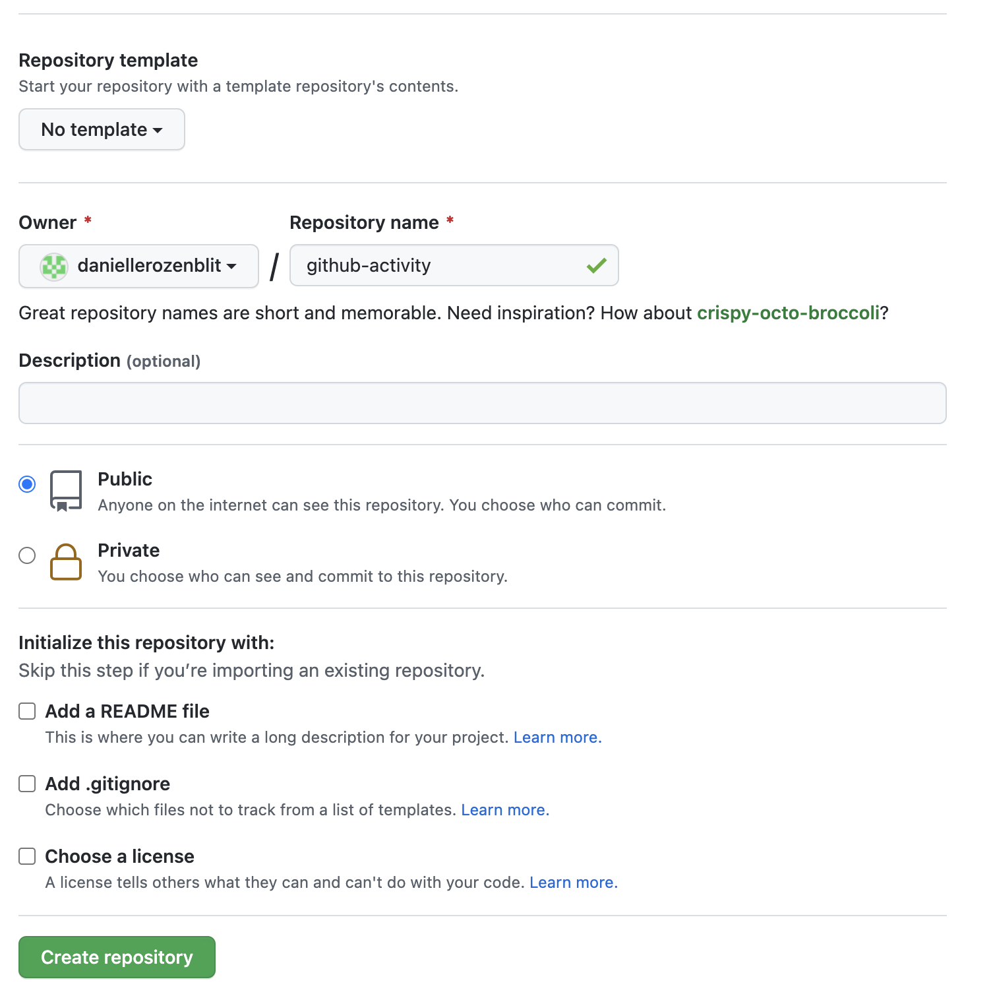
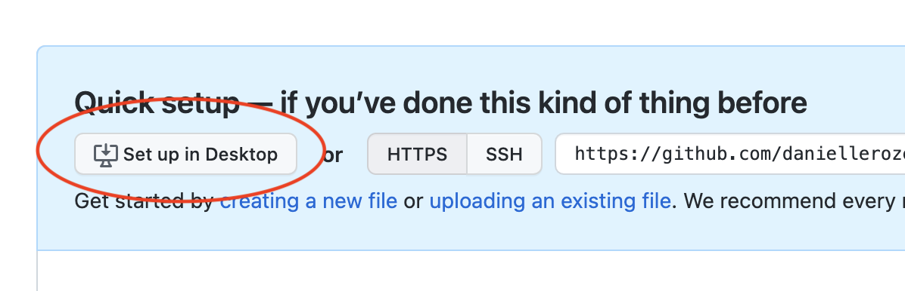
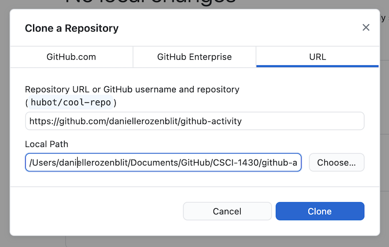
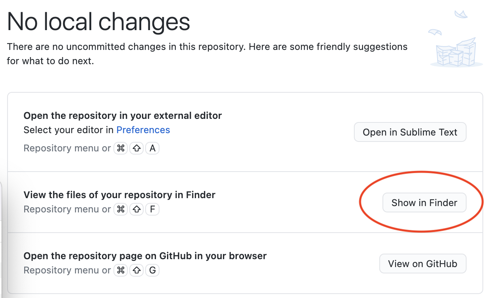
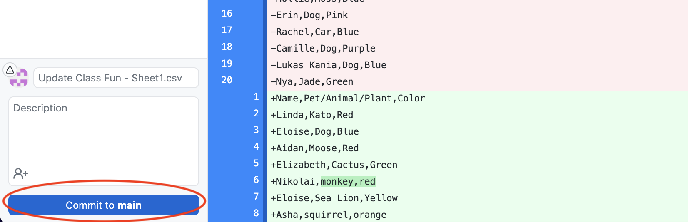
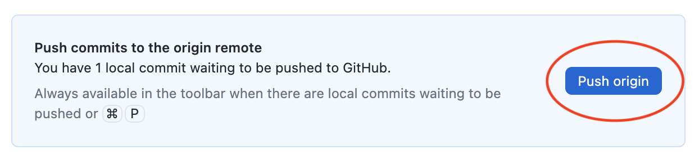

# Git Basics
In this activity you will **create** and **clone** a new Git repository. You will add a file to your new repository locally, **commit** your edits, and **push** your commit to GitHub.

## Creating a Repo
You can create a new Git repository directly from the GitHub website.

- [ ] Log into [GitHub](https://github.com/).
- [ ] Click the green "New" button in the top left corner of the webpage.

- [ ] Create a new repository with the following settings.

This should create a new repository with the name: \<username\>/github-activity.

## Setting-Up / Cloning a New Repo
Now you are going to set-up the new repository! You can to this by cloning the repo, which creates a local copy of the repository on your machine (where you can edit it).

- [ ] From the "quick setup" menu of your new repository, click the green "Set up in Desktop" button.

- [ ] This should open the following menu in GitHub Desktop. Select the blue "Clone" button.

This should clone the repository to your machine and open it in GitHub Desktop.

## Commiting Changes to a Repo
In order to edit the repo, you can access the files in the same way that you would for any other local files.

- [ ] From the GitHub Desktop Application, click "Show in Finder" in order to access the files in your file system.

- [ ] Your folder/repo should be empty!
- [ ] Add an image of your favorite animal to the github-activity folder (the same way that you would add an image to any local folder).

Now that you have made changes to the repository, it is time to commit those changes! You can conveniently do this from GitHub Desktop.

- [ ] Navigate back to GitHub Desktop.
- [ ] Click the blue "commit to main" button in the bottom left corner of the application.

Your changes should now be committed locally! In order to make these changes remotely (on GitHub), you must "push" them to to your remote repository.

- [ ] Share a copy of your GitHub repository address as your “submission” to the activity for unit 11.
