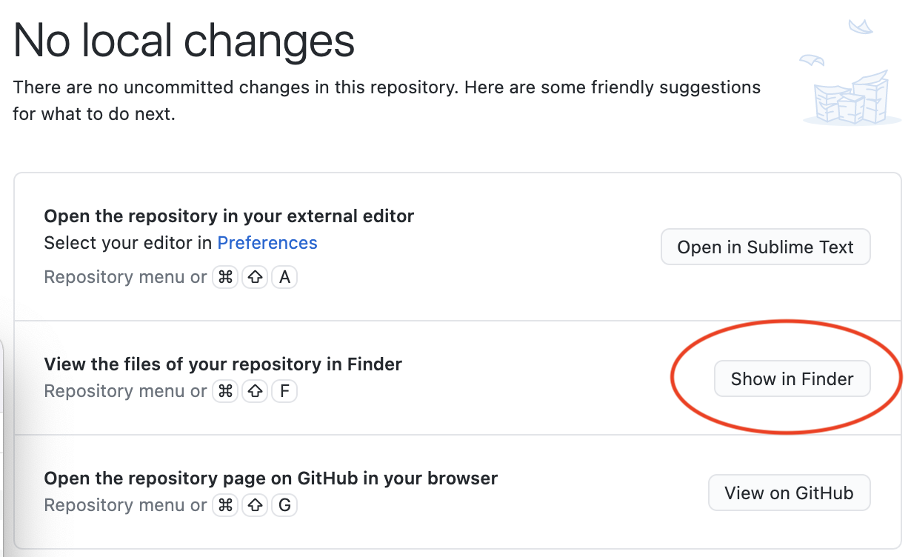
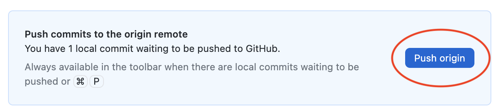

# Git Basics
In this activity you will **fork** and **clone** a GitHub repository so that you can edit the repo locally. You will also **commit** your edits, and submit a **pull request** to merge your changes with the original repository.

## Forking a Repo
On the GitHub website, fork the [repo](https://github.com/Linda-Clark/hello-world.git) I made. This will create a version of my repo in your GitHub account.
- [ ] Click "fork" in the top right corner of the webpage.

This should create a new repository with the name: \<username\>/hello-world.

## Cloning a Repo
Now you are going to clone the forked repository! This creates a local copy of the repository on your machine (where you can edit it).

- [ ] From the main view of your newly-forked repository, click the green "Code" button.
- [ ] Select the "Open With GitHub Desktop" option.

This should clone the repository to your machine and open it in GitHub Desktop.

## Commiting Changes to a Repo
In order to edit the repo, you can access the files in the same way that you would for any other local files.

- [ ] From the GitHub Desktop Application, click "Show in Finder" in order to access the files in your file system.

- [ ] Open the "Class Fun - Sheet1.csv" in your csv editor of choice (i.e. Excel).
- [ ] Add your name to the "class-fun" file and save.

Now that you have made changes to the repository, it is time to commit those changes! You can conveniently do this from GitHub Desktop.

- [ ] Navigate back to GitHub Desktop.
- [ ] Click the blue "commit to main" button in the bottom left corner of the application.

Your changes should now be committed locally! In order to make these changes remotely (on GitHub), you must "push" them to to your remote repository.

## Creating a Pull Request
You should receive a message to submit a pull request after changing the "class-fun" file.

- [ ] Click the pull request button to see the change you made and create your request.
- [ ] The request will then be automatically merged to update my (Linda’s) repository.
- [ ] Share a copy of your GitHub repository address as your “submission” to the activity for unit 11.
